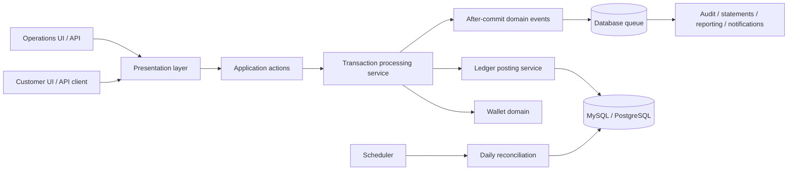
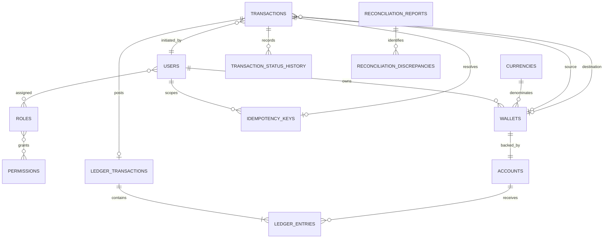

# LedgerFlow

LedgerFlow is a portfolio-grade digital wallet and immutable double-entry ledger built with Laravel 12 and PHP 8.2. It demonstrates financial transaction safety, exact money arithmetic, idempotent APIs, row-level locking, audit trails, asynchronous projections, and daily reconciliation.

This is an educational financial infrastructure project, not a licensed payment processor. Deposits in demo mode simulate an already-settled external payment; production settlement requires a trusted provider integration.

## Capabilities

- Multi-currency customer wallets whose balances are calculated from the ledger.
- Deposit, withdrawal, same-currency transfer, and compensating refund workflows.
- Immutable debit/credit journals with per-currency balance validation.
- Transaction lifecycle: `created → pending → processing → completed`; failures become `failed`, and refunded originals become `reversed`.
- User-scoped idempotency keys with request fingerprinting, response replay, stale-claim recovery, and unique business references.
- Database-queued notifications, statements, reporting projections, and audit events.
- Administrator transaction monitoring, ledger exploration, and reconciliation.
- Customer and administrator web interfaces plus a versioned JSON API.

## Architecture



Code is organized by bounded module under `app/Modules/<Module>`:

```text
Domain/                 Framework-light rules, value objects, enums, contracts
Application/Actions/    One application use case per action
Application/Services/   Workflow orchestration and application policy
Infrastructure/         Eloquent persistence, providers, queue adapters
Presentation/           HTTP requests, resources, controllers, middleware, CLI
```

Modules are Identity, Wallet, Transaction, Ledger, Reconciliation, Notification, Reporting, and Audit. Cross-module calls flow through application services or contracts; controllers do not post ledger entries directly.

## Financial model and database design

Money is accepted as a decimal string and converted to an integer minor-unit amount. For example, `EUR 100.00` is persisted as `10000`. Floating-point values are never used for posting.



Core invariants:

1. Every posted journal contains at least one debit and one credit.
2. For each currency in a journal, `SUM(debits) = SUM(credits)`.
3. Completed transactions reference exactly one ledger journal.
4. Ledger entries cannot be updated or deleted. Eloquent guards and database triggers enforce this.
5. Wallet balance is derived from posted ledger entries and is never a wallet column.
6. Wallet and account rows are locked in deterministic ID order during movement.
7. A wallet debit is rejected when its ledger-derived balance would become negative.

## API

All JSON endpoints use the `/api/v1` prefix. Protected requests use a Sanctum bearer token. Money-moving requests also require an `Idempotency-Key` header containing 8–128 characters from `A-Z`, `a-z`, `0-9`, `.`, `_`, `:`, or `-`.

| Method | Endpoint | Purpose |
|---|---|---|
| POST | `/auth/register` | Register a customer and issue a token |
| POST | `/auth/login` | Issue a token |
| GET | `/auth/me` | Return the authenticated identity and roles |
| DELETE | `/auth/tokens/current` | Revoke the current token |
| POST | `/wallets` | Create a wallet for an active currency |
| GET | `/wallets/{wallet}` | Read an owner-authorized wallet and ledger balance |
| POST | `/wallets/{wallet}/freeze` | Freeze an owned wallet |
| POST | `/wallets/{wallet}/unfreeze` | Unfreeze an owned wallet |
| POST | `/transactions/transfers` | Transfer between same-currency wallets |
| POST | `/transactions/deposits` | Simulate settled funding; demo mode only |
| POST | `/transactions/withdrawals` | Withdraw from an owned wallet |
| POST | `/transactions/{id}/refunds` | Post a full compensating refund |
| GET | `/transactions/{id}` | Read an owner-authorized transaction |
| GET | `/admin/dashboard` | Administrator summary |
| GET | `/admin/transactions` | Search and filter transactions |
| GET | `/admin/ledger/{id}` | Inspect and verify a journal |
| GET/POST | `/admin/reconciliation` | List or run reconciliation |

Example transfer:

```bash
curl -X POST http://localhost:8000/api/v1/transactions/transfers \
  -H "Authorization: Bearer YOUR_TOKEN" \
  -H "Content-Type: application/json" \
  -H "Idempotency-Key: client-transfer-0001" \
  -d '{
    "source_wallet_id": "01...",
    "destination_wallet_id": "01...",
    "amount": "100.00",
    "reference": "order-2026-0001"
  }'
```

Retrying the exact request with the same key returns the stored response and `Idempotent-Replayed: true`. Reusing the key with another payload returns `409`.

## Security controls

- Sanctum token authentication and Laravel session authentication.
- Role and permission primitives plus administrator and resource-owner policies.
- Named rate limits for authentication, general authenticated traffic, financial writes, and administrator traffic.
- Currency-aware precision/range validation before transaction processing.
- CSRF protection on web forms, session ID rotation, encrypted production-ready sessions, and secure response headers.
- Recursive redaction of passwords, tokens, authorization values, cookies, secrets, and API keys from audit state.
- Generic credential errors and exception logs that avoid request bodies and credentials.
- Demo deposits and displayed demo credentials are guarded by `DEMO_MODE`.

Rate limits are defense-in-depth, not a substitute for an edge firewall, bot protection, MFA, abuse monitoring, or provider-side controls.

## Local setup

Requirements: PHP 8.2+, Composer 2, Node.js, and either Docker Desktop or MySQL 8.x. Redis is not used.

### Docker

```bash
cp .env.example .env
docker compose build
docker compose up -d mysql
docker compose run --rm app php artisan key:generate
docker compose run --rm app php artisan migrate --seed
docker compose up -d
```

Open `http://localhost:8000/login`. The Compose stack runs the app, MySQL, and a database queue worker.

### Native

```bash
composer install
cp .env.example .env
php artisan key:generate
# Configure the MySQL DB_* variables first
php artisan migrate --seed
php artisan serve
```

Run the worker separately:

```bash
php artisan queue:work database --queue=audit,statements,reporting,notifications,default --sleep=1 --tries=3 --timeout=90
```

For a public portfolio environment, set `DEMO_MODE=true` and configure unique demo-only passwords. Run `php artisan migrate --seed --force` once. Never use real customer or payment data. Setting demo mode to false hides credentials and prevents simulated deposits.

## Testing

```bash
composer test
vendor/bin/pest
vendor/bin/pint --test
php artisan view:cache
```

The suite covers authentication, authorization, wallet lifecycle, exact money conversion, immutable entries, balanced posting, transaction failure, negative-balance prevention, idempotent replay/recovery, queued-listener idempotency, security controls, admin operations, and reconciliation.

`CompletedTransactionIntegrityTest` creates deposit, transfer, withdrawal, and refund workflows and asserts for every completed transaction that a journal exists and debit totals equal credit totals per currency.

The fast suite uses in-memory SQLite. Before a real release, run the same migration and integration suite against both supported production engines because SQLite cannot reproduce MySQL/PostgreSQL lock scheduling or isolation behavior.

## Laravel Cloud deployment

1. Connect the repository and select PHP 8.2 or newer.
2. Attach a Serverless Postgres database. Laravel Cloud injects its connection credentials; set `DB_CONNECTION=pgsql` and `DB_SSLMODE=require` where appropriate.
3. Use database-backed queues, cache, and sessions. No KV/Redis resource is required by LedgerFlow.
4. Configure an App or Worker background process:

   ```bash
   php artisan queue:work database --queue=audit,statements,reporting,notifications,default --sleep=1 --tries=3 --timeout=90
   ```

5. Enable the scheduler and use this deploy command:

   ```bash
   php artisan migrate --force
   ```

6. Set `APP_ENV=production`, `APP_DEBUG=false`, `APP_URL=https://...`, `LOG_CHANNEL=stderr`, `LOG_LEVEL=warning`, `QUEUE_CONNECTION=database`, `CACHE_STORE=database`, `SESSION_DRIVER=database`, and `SESSION_ENCRYPT=true`.
7. Seed demo accounts only for an isolated portfolio environment. Do not run the demo seeder against a real financial environment.

Laravel Cloud automatically injects attached database credentials, restarts queue processes after deployments, and treats the application filesystem as ephemeral. Build-time optimization belongs in the build command; deploy commands should remain limited to migrations and essential state changes. See the official [environment](https://cloud.laravel.com/docs/environments), [Postgres](https://cloud.laravel.com/docs/resources/databases/postgres), and [queue](https://cloud.laravel.com/docs/queues) documentation.

The Docker image includes both `pdo_mysql` and `pdo_pgsql`. Migrations contain database-specific immutable-ledger triggers for MySQL, PostgreSQL, and SQLite.

## Engineering decisions and trade-offs

| Decision | Reason | Trade-off |
|---|---|---|
| Integer minor units | Exact arithmetic and database portability | Currency metadata is required for display and parsing |
| Ledger-derived balances | One auditable financial source of truth | Reads aggregate entries and need projection/caching strategy at scale |
| Eloquent plus row locks | Clear Laravel implementation with safe writes | Lock behavior must be integration-tested per database engine |
| Database queue | Durable, simple deployment without Redis | Lower throughput and more database contention than a dedicated broker |
| Synchronous ledger posting | Caller knows the committed financial result | Longer request latency than asynchronous orchestration |
| Compensating refunds | Preserves immutable history | Reversal workflows are more complex than updating records |
| At-least-once events | Works naturally with database queues | Every listener/projection must remain idempotent |
| Modular monolith | Strong boundaries without distributed transaction complexity | Boundaries rely on code review rather than process isolation |

## Operational gaps before handling real money

This portfolio demonstrates engineering patterns, but real-money deployment would additionally require an outbox for guaranteed event publication, provider-signed deposit webhooks, MFA and token abilities, KYC/AML and sanctions workflows, configurable transaction limits, maker-checker approvals, secrets management, observability/SLOs, backups and restore drills, disaster recovery, penetration testing, load/lock-contention testing, and jurisdiction-specific compliance.

The detailed final review is in [docs/production-readiness-review.md](docs/production-readiness-review.md), and the original system design is in [docs/technical-design.md](docs/technical-design.md).
